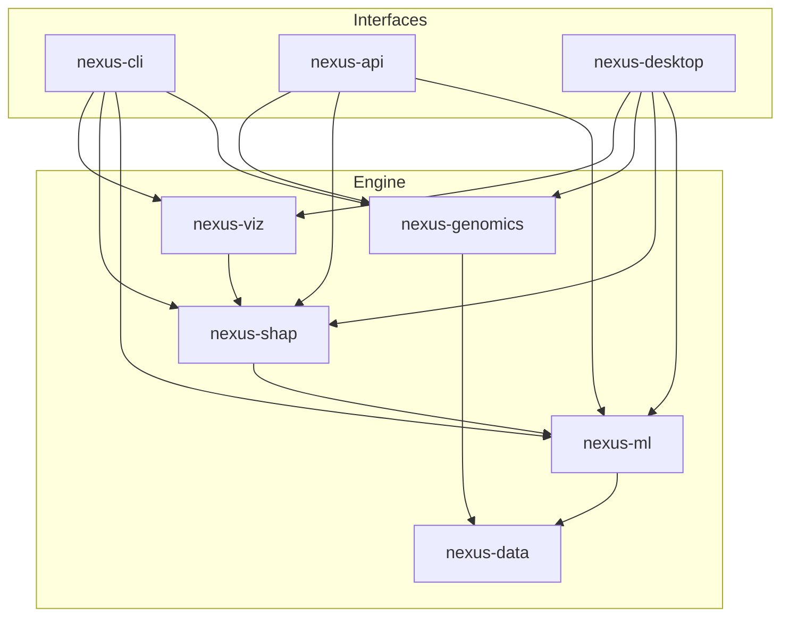

# Open Nexus (Rust)

A **Rust-native** reimplementation of [Open_Nexus](https://github.com/SampleBias/Open_Nexus) /
[OncoNPC](https://github.com/itmoon7/onconpc): predict the primary cancer type of a tumor
(including **cancer of unknown primary**, CUP) from its molecular profile, with exact,
explainable predictions — **no Python at runtime**.

This project preserves the full capability of the original (genomic feature engineering,
XGBoost inference, k-fold training orchestration, SHAP explanations, and the documented
REST API) and adds a native desktop application.

> Clinical/research software derived from OncoNPC (Moon et al., *Nature Medicine* 2023).
> Licensed **GPL-2.0-only**, inherited from upstream.

---

## Why Rust

- **Single static toolchain** — inference, explanation, API and desktop ship as native
  binaries; no Python/conda environment to manage in production.
- **Exact native Tree SHAP** — the clinically critical explanations are computed in-process
  (no `shap` dependency), anchored by the SHAP local-accuracy property in tests.
- **Polars everywhere** — the same dataframe library powers production I/O and CI parity
  checks, so CI is `cargo test` with zero Python.

---

## Architecture

A Cargo workspace of focused crates (each owned by a development team — see
[`docs/TEAMS.md`](docs/TEAMS.md)):

| Crate | Responsibility |
|-------|----------------|
| [`nexus-core`](crates/nexus-core) | Domain types, errors, feature taxonomy, `FeatureMatrix`, config |
| [`nexus-data`](crates/nexus-data) | Polars I/O: Parquet/TSV feature matrices, JSON artifacts, GENIE & signature loaders |
| [`nexus-genomics`](crates/nexus-genomics) | SBS96 trinucleotide context, signature projection, feature assembly, FASTA genome |
| [`nexus-ml`](crates/nexus-ml) | Native XGBoost JSON inference, k-fold CV, low-frequency filtering, metrics |
| [`nexus-shap`](crates/nexus-shap) | Exact polynomial-time Tree SHAP + grouped explanations |
| [`nexus-viz`](crates/nexus-viz) | Dependency-free SVG SHAP bar charts (replaces matplotlib) |
| [`nexus-cli`](crates/nexus-cli) | `nexus` binary: `process-features`, `train`, `predict`, `explain` |
| [`nexus-api`](crates/nexus-api) | Axum REST server matching the documented contract |
| [`nexus-testkit`](crates/nexus-testkit) | Polars snapshot diffing + property tests for CI |
| [`nexus-desktop`](crates/nexus-desktop) | Tauri 2 desktop app (built separately) |



### Key engineering decision: native XGBoost JSON inference

Instead of linking the XGBoost C library, `nexus-ml` parses the JSON produced by
`Booster.save_model("model.json")` into a `TreeEnsemble`. This:
1. removes a heavy native build dependency (works fully offline), and
2. gives `nexus-shap` direct access to the tree structure required for exact Tree SHAP.

Probabilities match the upstream `predict(output_margin=True)` + softmax path; because
softmax is shift-invariant, the scalar `base_score` cancels for `multi:softprob` and does
not affect probabilities (it is retained for SHAP base values).

---

## Quick start

```bash
cargo build --workspace
cargo test --workspace        # 48 tests, no Python required
```

### Predict from raw patient input

```bash
./target/debug/nexus predict \
  --model    examples/model.json \
  --metadata examples/metadata.json \
  --raw      examples/patients.json \
  --manifest examples/manifest.json \
  --age-stats examples/age_stats.json \
  --genome   examples/genome.fa \
  --top-n 2
```

### Explain (native Tree SHAP) + SVG charts

```bash
./target/debug/nexus explain \
  --model examples/model.json --metadata examples/metadata.json \
  --raw examples/patients.json --manifest examples/manifest.json \
  --age-stats examples/age_stats.json --genome examples/genome.fa \
  --top-n 10 --out-dir examples/out
```

### Run the API server

```bash
NEXUS_MODEL=examples/model.json \
NEXUS_METADATA=examples/metadata.json \
NEXUS_MANIFEST=examples/manifest.json \
NEXUS_AGE_STATS=examples/age_stats.json \
NEXUS_GENOME=examples/genome.fa \
NEXUS_BIND=127.0.0.1:5000 \
  ./target/debug/nexus-api
```

Endpoints (Basic auth, JSON, matching the upstream README):
`POST /api/v1/auth/register`, `POST /api/v1/predictions/predict`,
`GET /api/v1/predictions/history`, `GET /api/v1/health`.

### Desktop app

```bash
cd crates/nexus-desktop
# Requires the Tauri prerequisites (Rust, Node, webkit2gtk on Linux).
cargo tauri dev
```

---

## Bringing your own model & data

The repository ships small synthetic `examples/` artifacts so everything runs out of the
box. For real OncoNPC models and AACR GENIE data:

1. Obtain a trained XGBoost model saved as JSON + a `model_metadata.json`
   (`{"features": [...], "target_classes": [...]}`).
2. Migrate the upstream pickles once with
   [`tools/pickle-migrate/migrate.py`](tools/pickle-migrate/migrate.py)
   to produce `features_onconpc.json` and `combined_cohort_age_stats.json`.
3. Provide signature weight CSVs (COSMIC SBS format) and a reference FASTA for SBS96.

See [`docs/DATA.md`](docs/DATA.md).

---

## Testing & CI parity (Polars, no Python)

Reference outputs are exported **once** from the upstream Python pipeline to committed
Parquet files under `tests/snapshots/` via
[`tools/snapshot-export/export_snapshots.py`](tools/snapshot-export/export_snapshots.py).
Every CI run compares the Rust pipeline against those snapshots with `nexus-testkit`'s
Polars `assert_matrix_near`, plus property tests (96 SBS channels, probabilities sum to 1,
SHAP local accuracy). CI never runs Python.

---

## License

GPL-2.0-only, inherited from OncoNPC / Open_Nexus.
